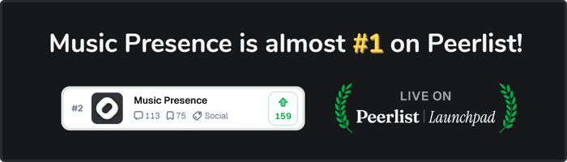

# Upvote Music Presence on Peerlist

## Upvote Music Presence on peerlist.io

I have published Music Presence on
[**peerlist.io**](https://peerlist.io/ungive/project/music-presence),
a weekly leaderboard for aspiring software projects.
This is a great opportunity to get the word out for the app
and to make a mark on a large platform like Peerlist.
5 minutes of your time could make a real difference!
The voting closes on Sunday.

Please leave a review, so we can get Music Presence to the **very top**!
As a thank you,
you get a **special role** on the
[**Discord server**](https://discord.gg/7rc8dWD4ug)
and you can enter the small **giveaway** below!

&nbsp;

## How can you help?

1. Visit **[https://peerlist.io/ungive/signup](https://peerlist.io/ungive/signup)**
2. Continue with Google or enter an e-mail and password
3. Enter your profile information. Using a nickname is perfectly fine
4. Notice the progress at the bottom: "You can't interact yet". Connect one account under the "Work" tab, e.g. your GitHub account and you should be able to interact. Make sure it says you can interact before continuing
5. Now visit the project page: **[https://peerlist.io/ungive/project/music-presence](https://peerlist.io/ungive/project/music-presence)**
6. **Upvote** by clicking the black "Upvote" button
7. **Bookmark** by clicking the flag icon in the top menu, next to the share button
8. **Comment** your experience with Music Presence under "How does this project inspire you?" - You can also upvote a comment of another user, if you resonate with what they wrote, but writing your own comment helps the most!
9. Scroll down for information on the giveaway and Discord role!

&nbsp;

## What happens when Music Presence reaches the top 3?

Quoting the [Peerlist FAQ](https://help.peerlist.io/individual/launchpad/frequently-asked-questions-about-spotlight-by-peerlist) on their website:

> *The winners will be featured in Peerlist’s weekly emails and social media channels, providing valuable exposure to the builders. Additionally, the winners will receive a special badge for their products, showcasing their achievements and potentially attracting new opportunities.*

I truly believe we can achieve this. If you don't have time now, please set a reminder for later! Thank you for putting the effort in to help Music Presence grow. Reaching the top 3 would be a big step forward for the future of the app!

&nbsp;

## Giveaway & Discord Role

Every signup with the link in step 1 earns me $1 in virtual credits
for the [Peerlist Store](https://store.peerlist.io).
I want to give this back to you by using those credits
to send you an item from the store of your choosing!
They have some pretty nice stuff.

To enter the giveaway:
1. Complete the steps above. **Only do this once!**
   The [Peerlist Terms](https://help.peerlist.io/individual/referrral-program-terms-and-conditions) forbid multiple accounts.
2. Join the [Discord server](https://discord.gg/7rc8dWD4ug)
   and DM me **@ungive**. You can click on my name in the **#rules** channel to open a DM.
   Tell me your Peerlist username and that you want to enter the giveaway.
   That's it!
3. You will get the green animated **@Superpeer** Discord role and
   I will announce the winner on the Discord server on Monday, 14. July 2025 at 8 PM CEST

&nbsp;

Completing the steps above earns you 5 entries in the giveaway.
You can additionally earn 2 entries for each of the points below.
Please DM me which of these you completed:

- Follow my X account: [@musicpresenceio](https://x.com/musicpresenceio)
- Like and repost my latest X post: [Music Presence is looking for funding](https://x.com/musicpresenceio/status/1942662953393873094). There will be more news regarding this topic here within the Music Presence app soon. Stay tuned!
- Follow my Peerlist account: [peerlist.io/ungive](https://peerlist.io/ungive)
- Like this Peerlist post: [The future of sharing your music](https://peerlist.io/scroll/post/ACTH6AJDK9PKABAAN1R7K6EKKMLNOK)

Depending on how many store credits we collect,
there will be one or multiple winners!

&nbsp;

## Thank you

I want to say thank you for using my app
and thank you for taking the time to help increase the exposure on Peerlist.
It would be a milestone, both for Music Presence and for me personally,
to achieve being in the top 3 on a large platform like Peerlist!

Kindly, Jonas

<!-- button -->
[View the project on Peerlist](https://peerlist.io/ungive/project/music-presence)

<!-- button aside -->
[Join the Discord server](https://discord.gg/7rc8dWD4ug)
