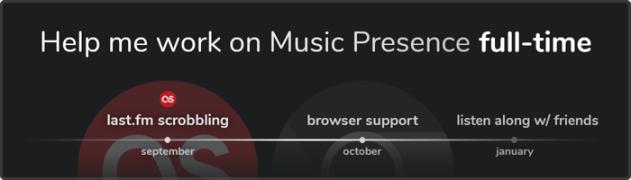

## Music Presence needs your help

Hello, it's Jonas, the creator of Music Presence!

I want to let you know about the future of the app
and how you can help **keep the project alive**.

You may not know this, but I'm the **only developer**
behind Music Presence. I've put a lot of love into the project
since around May 2024
and I am extremely motivated to keep going,
but due to recent events in my life,
I won't have enough time for the project anymore soon.

I am looking for **financial support** from users like you,
so I can work on the following features:

- **last.fm scrobbling**, universal for all operating systems and all media players
- **browser support** to detect media from websites in addition to desktop apps
- **listening along**, so you can sync your music playback to that of your friends

&nbsp;

To help, you can **donate a small amount**,
either on a monthly basis or one time.
My goal is to find enough supporters to sustain a living,
so that I can be independent of a corporate job.

You can find the donation goal and progress on my website:
[**musicpresence.app**](https://musicpresence.app?utm_source=app&utm_medium=news).
There you will also find the
[**project timeline**](https://musicpresence.app?utm_source=app&utm_medium=news#timeline),
[**available donation options**](https://musicpresence.app/donate?utm_source=app&utm_medium=news) and
[**a list of all current sponsors**](https://musicpresence.app/sponsors?utm_source=app&utm_medium=news).

&nbsp;

#### Everything you need to know

- You will be among the first to test all new features once they are available.
- You are [one of many](https://musicpresence.app/sponsors?utm_source=app&utm_medium=news)
who choose to donate to the project. Music Presence has more than 10.000&nbsp;daily&nbsp;users,
even a very small donation can have a great impact.
- Visit my [website](https://musicpresence.app?utm_source=app&utm_medium=news)
and read the [FAQ](https://musicpresence.app/donate?utm_source=app&utm_medium=news#faq)
to find more answers to frequently asked questions.
- Subscribe to [this GitHub issue](https://github.com/ungive/discord-music-presence/issues/344)
to be in the loop on all updates regarding the donation goal
and the project going forward.
I will inform you if the goal has been reached on the 10th of August.
- Do not hesitate to contact me, if you have any more questions!
E-mail me at [contact@musicpresence.app](mailto:contact@musicpresence.app)
or join the [Discord server](https://discord.gg/GemxJsWKMD)
and say Hello. We are a very friendly community!
I reply to all messages in a timely manner.

&nbsp;

I can't wait to work on the next features! ❤️

&nbsp;

<!-- button aside -->
[Contact me](mailto:contact@musicpresence.app)

<!-- button aside -->
[Translate](https://github-com.translate.goog/music-presence/news/blob/write/news/4/content.md?_x_tr_sl=auto&_x_tr_tl=en&_x_tr_hl=en&_x_tr_pto=wapp)

<!-- button -->
[Visit the website](https://musicpresence.app)

<!-- button -->
[Donate](https://musicpresence.app/donate)

<!-- urgent -->
Please take a moment to read this message,
especially the part after "**Why fund this project?**"
where I talk about my plans for the future of Music Presence
and where I am currently at in life.

If you like Music Presence, you might like the vision I have for it
and where I intend to take the project.

You can also visit my website:
[**musicpresence.app**](https://musicpresence.app)
